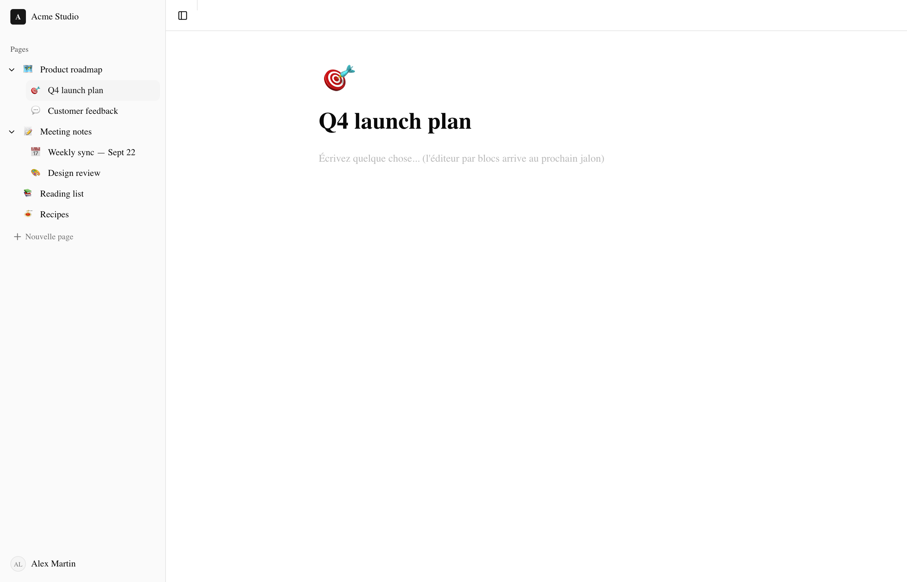
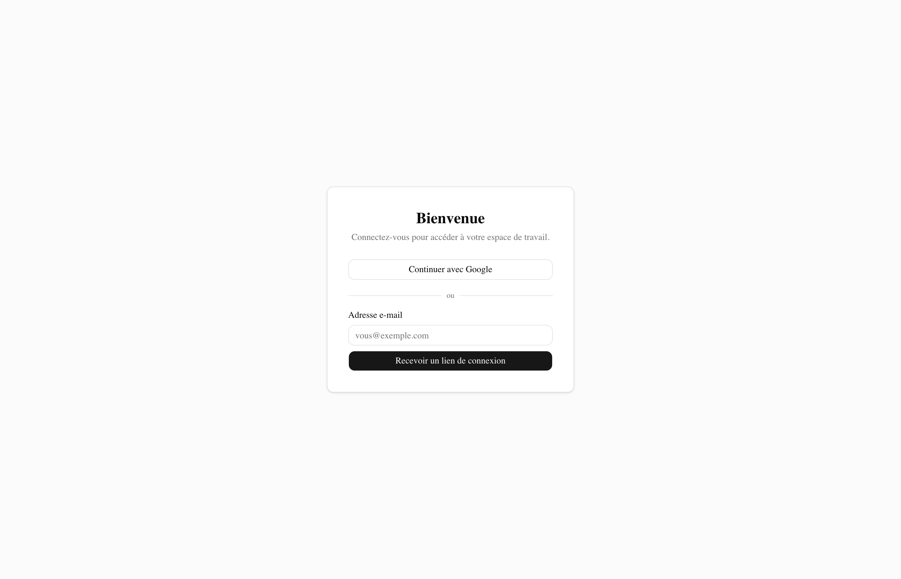

# Assistant Note — a Notion-style workspace

A note-taking app with structured pages: nested pages made of editable blocks, organised in a sidebar tree, with databases displayable in several views planned. It is built milestone by milestone; only what is ticked below is considered done and browser-tested.

**Stack:** Next.js (App Router, strict TypeScript), PostgreSQL + Prisma, Tailwind CSS + shadcn/ui, TipTap, Auth.js, Vitest + Playwright.

> The UI is in French.

## Screenshots

*Screenshots use a demo workspace ("Acme Studio") with made-up pages and user.*

| Workspace | Sign-in |
| --- | --- |
|  |  |

## Status

- [x] **Milestone 1 — Foundations**: Prisma schema, authentication (magic email link + Google), layout and sidebar with page tree, page CRUD (create, rename, soft delete), autosave
- [ ] Milestone 2 — Block editor (TipTap)
- [ ] Milestone 3 — Advanced nesting, drag and drop, trash, favourites, breadcrumbs
- [ ] Milestone 4 — Databases (table / board / list / calendar views, filters, sorts)
- [ ] Milestone 5 — Search, mentions, backlinks
- [ ] Milestone 6 — Sharing, roles, public link
- [ ] Milestone 7 — Real-time collaboration (Yjs)
- [ ] Milestone 8 — Polish (performance, accessibility, empty / loading states)

## Data model: ordering and nesting

- **Page tree** (sidebar): parent pointer (`Page.parentId`) + fractional index (`Page.position`, `fractional-indexing` package) for ordering siblings. Moving a page only rewrites that page's position, never its neighbours', so a move stays O(1) whatever the list size. The trade-off: positions are strings compared lexicographically, and repeated inserts at the same spot make them grow (fine at this scale; periodic rebalancing remains possible).
- **Blocks inside a page**: *no* separate table. TipTap owns one ProseMirror document per page, stored as-is in `Page.content` (JSON). The ProseMirror node tree already *is* the block tree: nesting, ordering, drag and drop and indentation are native editor transactions. Search and backlinks rely on `Page.plainText`, extracted from the JSON on save.

## Requirements

- Node.js 20.19+
- pnpm (`npm install -g pnpm`)
- Docker (for a local PostgreSQL) or an existing PostgreSQL instance

## Setup

```bash
pnpm install
cp .env.example .env          # edit if needed (Google OAuth, SMTP…)
docker compose up -d          # PostgreSQL on localhost:5432
pnpm exec prisma migrate dev
pnpm dev                      # http://localhost:3000
```

The first sign-in automatically provisions a personal workspace with a welcome page.

### Environment variables

See `.env.example`.

| Variable | Purpose |
|---|---|
| `DATABASE_URL` | PostgreSQL connection string |
| `AUTH_SECRET` | Auth.js secret (`openssl rand -base64 32`) |
| `AUTH_URL` | Public app URL (dev: `http://localhost:3000`) |
| `AUTH_GOOGLE_ID` / `AUTH_GOOGLE_SECRET` | Google OAuth credentials (optional in dev) |
| `EMAIL_FROM`, `EMAIL_SERVER_*` | SMTP used to send the sign-in link |

**Email sign-in without SMTP:** in development, when `EMAIL_SERVER_HOST` is empty, the sign-in link is printed in the server console instead of being emailed, so the whole flow can be tested without an SMTP service.

**Google OAuth:** create credentials in the [Google Cloud Console](https://console.cloud.google.com/apis/credentials) with `http://localhost:3000/api/auth/callback/google` as redirect URI.

## Migrations

```bash
pnpm exec prisma migrate dev --name <description>   # new migration (dev)
pnpm exec prisma migrate deploy                       # apply in production
pnpm exec prisma generate                             # regenerate the client (src/generated/prisma, git-ignored)
```

## Quality

```bash
pnpm typecheck
pnpm lint
pnpm build
```
